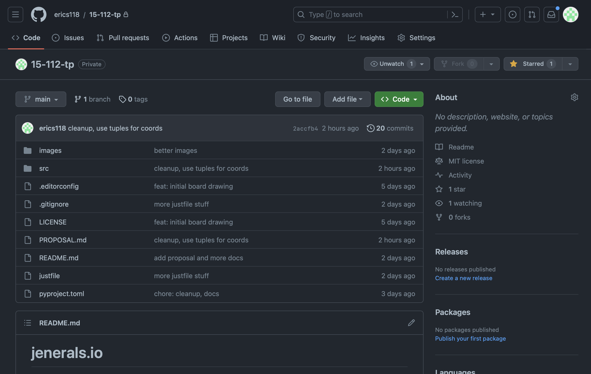

# TP0: Project Proposal (20 pts)

## Project Proposal Components (15 pts)
<!-- Write up a proposal file (in the file proposal.txt, or .docx, or .pdf) which should include the following components: -->

### Project Description (2.5 pts)
<!-- The name of the term project and a short description of what it will be. -->

The name of the project is jenerals.io, which is a clone of [generals.io](https://generals.io/).
The game is played on a 2D grid, where each cell is fog, city, mountain, the player's general, or the bot's general. The goal is to get enough troops to capture the bot's general.

### Similar projects (2.5 pts)
<!-- A 1-2 paragraph analysis of similar projects you've seen online, and how your project will be similar or different to those. -->

The only similar project is [generals.io](https://generals.io/), as my project is a clone of it.

Map-making/editing will not be implemented. All maps will be randomly generated.

Multiplayer will not be implemented. The game will be single-player only, with the player playing against a bot.

### Structural Plan (2.5 pts)
<!-- A structural plan for how the finalized project will be organized in different functions, files and/or classes. -->

File structure:
- `images/` - images used in the game
- `src/` - source code
  - `classes/` - classes used in the game
  - `events/` - event handlers
  - `utils/` - utility functions
  - `main.py` - main file

### Algorithmic Plan (2.5 pts)
<!-- A plan for how you will approach the trickiest part of the project. Be sure to clearly highlight which part(s) of your project are algorithmically most difficult, and include some details of how you expect to implement these features. -->

There are a few really tricky parts.

#### Map generation

From my experience, the map seems to be just generated randomly, with hardcoded chances for a city or mountain to appear. I will do the same.

One concern is that it is possible for certain cells to be unreachable. I will have to make sure that every non-obstacle block is reachable from any other non-obstacle block. I will use a simple flood-fill algorithm to do this.

#### Bot AI

The bot AI is probably the most difficult part, and I will have to do some research on how to implement it. I will probably use a minimax algorithm with alpha-beta pruning.

Alternatively, I could code a strategy based on how top players play. The basic strategy is as follows:

1. Do not move until you have exactly 17 troops in the general's cell.
2. Move in a relatively straight line to an open space where you think the enemy's general is most likely to be.
  1. If you find an enemy square, wait til turn 50 so that all every cell gets one more troop. Then, Collect all the troops and continue attacking from there
   2. Otherwise, go in another direction. do 2.1 if you find an enemy square. Otherwise, idk
3. If quite a few troops have been collected, capture a city.
3. Repeat step 2

### Timeline Plan (2.5 pts)
<!-- A timeline for when you intend to complete the major features of the project. -->

- TP0: August 1
  - Finish MVP for one player
- TP1: August 5
  - Finish bot movement with basic strategy
- TP2: August 8
  - Finish bot strategy
- TP3 (Project Due Date): August 10
  - Polish up the game and fix weird bugs

### Version Control Plan (1.5 pts)
<!-- A short description and image demonstrating how you are using version control to back up your code. Notes:

You must back up your code somehow!!!
Your backups must not be on your computer (ideally, store them in the cloud) -->

I will be using [GitHub](https://github.com/) as my version control system. The private repository is located at [`erics118/15-112-tp`](https://github.com/erics118/15-112-tp).

Image: 

### Module List (1 pts)
<!-- A list of all external modules/hardware/technologies you are planning to use in your project. Note that any such modules must be approved by a tech demo. If you are not planning to use any additional modules, that's okay, just say so! -->
For TP0, I said that I will not be using any modules.

After the MVP, I may decide to use some AI module, like [tensorflow](https://www.tensorflow.org/), but I am not sure yet.

Alternatively, I might use an image processing module, such as [PIL](https://pillow.readthedocs.io/en/stable/).

## Storyboard (5 pts)
<!-- Generate a storyboard that demonstrates how a user would interact with your finished project. A storyboard is just a series of sketches showing (roughly) what your project will look like. Your storyboard should have at least six panels, and at least three of those should demonstrate features within the project. You may scan or take a picture of your storyboard and include it in the directory as the file storyboard.png (other acceptable filetypes include .gif, .jpg, and .pdf). -->

<!-- Include any preliminary code files you have already created at this stage. Some code at this stage would be helpful, but not necessary. It may be prototype code, and so perhaps may not be part of your final project. It also may or may not have any user interface. -->

<!-- Note: Your TP0, TP1, TP2, collectively count for one quiz grade. -->

## Questions

- can storyboard be images of the original game that i clone?
- do i need explain each panel, or are images enough?
- what level of cleanness and detail?
